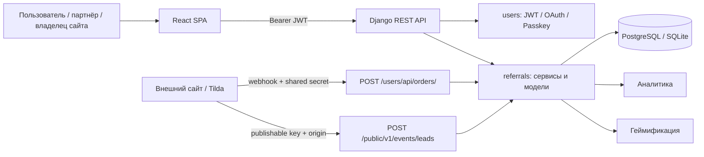
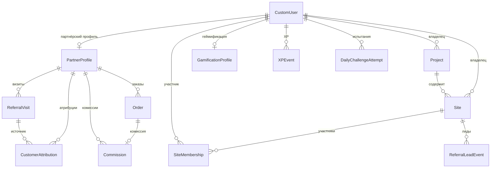
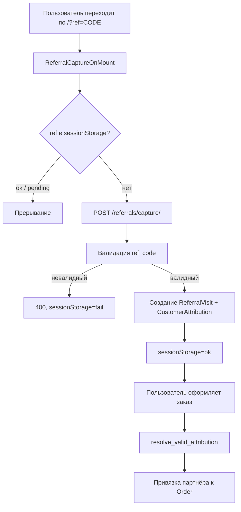
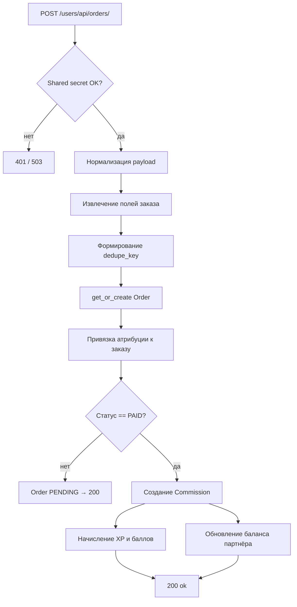
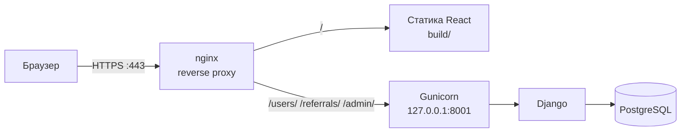

# Глава 3. Проектирование и реализация веб-системы учёта реферальных ссылок

---

## 3.1. Общая характеристика разработанной системы

Разработанная система представляет собой веб-приложение для автоматизированного учёта реферальных ссылок, фиксации визитов и заказов, расчёта партнёрских комиссий и отображения аналитики в личных кабинетах участников. Система получила рабочее название **LumoRef**.

Назначение системы состоит в объединении трёх категорий участников в единой инфраструктуре: владельцев сайтов (продавцов), партнёров-распространителей и покупателей. Владелец подключает свой сайт к платформе, задаёт процент комиссии и размещает встроенный виджет на своих страницах. Партнёр получает персональную реферальную ссылку, привлекает покупателей и отслеживает поступающие заказы и начисления в личном кабинете. Заказы принимаются посредством webhook-интеграции с внешними сайтами и конструкторами страниц, в первую очередь с платформой Tilda.

### Решаемые задачи

Система решает следующий комплекс задач:

- генерация и хранение уникальных реферальных кодов для каждого партнёра;
- фиксация переходов по реферальным ссылкам с поддержкой атрибуции с ограниченным сроком действия (TTL);
- приём, нормализация и дедупликация заказов через webhook;
- автоматический расчёт партнёрской комиссии при подтверждении оплаты;
- ведение личных кабинетов партнёра и владельца сайта с агрегированной статистикой;
- публичный API для embed-виджета на внешних сайтах;
- геймификация партнёрской активности посредством системы опыта (XP), streak-серий, ежедневных испытаний и рейтингов;
- многофакторная аутентификация пользователей: email/пароль, OAuth-провайдеры, passkey.

### Роли пользователей

Система поддерживает следующие роли. Разграничение реализовано через доменные модели и ownership-связи; отдельная RBAC-модель в текущей реализации не выделена.

| Роль | Доменная связь | Файлы модели |
|---|---|---|
| Пользователь | `CustomUser` | `backend/users/models.py` |
| Партнёр | `PartnerProfile` (OneToOne к `CustomUser`) | `backend/referrals/models.py` |
| Владелец сайта | `Site.owner`, `Project.owner` | `backend/referrals/models.py` |
| Участник программы | `SiteMembership` | `backend/referrals/models.py` |
| Администратор | Django admin | `backend/core/urls.py` |

Один и тот же пользователь может одновременно выступать партнёром в реферальной программе другого владельца и владельцем собственного сайта.

### Архитектурный класс

Система реализована как **full-stack клиент-серверное веб-приложение** и состоит из следующих компонентов:

- **клиентская часть** (React SPA) — реализует маршрутизацию, пользовательский интерфейс личных кабинетов и захват реферального параметра;
- **серверная часть** (Django REST API) — реализует бизнес-логику, работу с данными, аутентификацию и интеграционные endpoint'ы;
- **база данных** — PostgreSQL в production-среде, SQLite при локальной разработке;
- **интеграционные endpoint'ы** — публичный API виджета (`/public/v1/`) и webhook приёма заказов (`/users/api/orders/`).

---

## 3.2. Используемый технологический стек

| Компонент | Технология | Назначение | Файлы / конфигурация |
|---|---|---|---|
| Язык клиентской части | JavaScript (ES2022+) | Логика SPA | `frontend/src/` |
| UI-библиотека | React 19 | Компонентный интерфейс | `frontend/package.json` |
| Маршрутизация (frontend) | React Router 7 | SPA-навигация без перезагрузки страницы | `frontend/src/pages/home/App.js` |
| Инструмент сборки | Create React App (react-scripts 5) | Сборка, dev-сервер, запуск тестов | `frontend/package.json` |
| Иконки UI | lucide-react | Векторные иконки интерфейса | `frontend/package.json` |
| 3D-графика | three.js | Интерактивный фон главной страницы | `frontend/package.json` |
| Flow-диаграммы в ЛК | @xyflow/react | Схемы интеграции | `frontend/package.json` |
| Язык серверной части | Python 3.11 | Серверная логика | `backend/` |
| Backend-фреймворк | Django 5.2 | ORM, маршрутизация, admin, сессии | `backend/requirements.txt` |
| REST-слой | Django REST Framework 3.15 | Сериализаторы, APIView, разрешения, throttling | `backend/requirements.txt` |
| JWT-аутентификация | djangorestframework-simplejwt 5.3 | Access/refresh-токены | `backend/requirements.txt` |
| CORS | django-cors-headers 4.4 | Политика кросс-доменных запросов | `backend/requirements.txt` |
| База данных (production) | PostgreSQL 16 | Основное хранилище | `docker-compose.yml` |
| База данных (разработка) | SQLite | Быстрый локальный старт | `backend/core/settings.py` |
| ORM и миграции | Django ORM | Работа с данными, версионирование схемы | `backend/referrals/migrations/`, `backend/users/migrations/` |
| OAuth-вход | Google OAuth 2.0, VK ID, Telegram Login | Альтернативные методы аутентификации | `backend/users/google_verify.py`, `backend/users/vk_oauth.py`, `backend/users/telegram_auth.py` |
| Passkey/WebAuthn | webauthn 2.2 | Вход без пароля | `backend/requirements.txt`, `backend/users/passkey_views.py` |
| HTTP-сервер (production) | Gunicorn 23 | WSGI production-сервер | `deploy/systemd/lumoref-gunicorn.service` |
| Reverse proxy (production) | nginx | Обслуживание статики React, проксирование API | `deploy/nginx/lumoref.conf` |
| CI/CD | GitHub Actions | Автоматический запуск тестов и деплой | `.github/workflows/ci.yml`, `.github/workflows/deploy.yml` |
| Тестирование (backend) | Django test runner | Unit- и интеграционные тесты | `backend/referrals/tests/` |
| Тестирование (frontend) | Jest + Testing Library | Компонентные тесты | `frontend/src/__tests__/` |
| Сканирование страниц | playwright, beautifulsoup4 | Проверка установки виджета на сайте | `backend/referrals/page_scan.py` |
| Транзакционная почта | Brevo API / RuSender API / SMTP | Письма для восстановления пароля | `backend/core/settings.py` |

**Обоснование выбора стека.** Django предоставляет зрелую ORM, встроенную систему миграций, административный интерфейс и развитую экосистему расширений, что существенно сокращает объём ручного кода при разработке API и управлении данными. Django REST Framework стандартизирует сериализацию, модель разрешений и throttling. Использование SimpleJWT обеспечивает stateless-аутентификацию без необходимости серверного хранилища сессий для REST-клиентов. React позволяет реализовать динамичный личный кабинет в виде SPA с минимальным числом полных перезагрузок страницы. Сочетание PostgreSQL (production) и SQLite (разработка) обеспечивает гибкость: SQLite ускоряет локальный старт, PostgreSQL используется в среде с повышенными требованиями к надёжности и параллелизму.

---

## 3.3. Архитектура системы

### Принципы организации

Система построена по классической клиент-серверной модели. Клиентская часть (React SPA) взаимодействует с серверной (Django REST API) исключительно через HTTP/JSON-интерфейс. Разделение на микросервисы не применяется: вся серверная бизнес-логика сосредоточена в одном Django-процессе, что соответствует масштабу и задачам MVP.

Серверная часть структурирована в виде двух Django-приложений. Приложение **`users`** отвечает за регистрацию, аутентификацию (email/пароль, JWT, OAuth, passkey), управление профилем пользователя, поддержку и восстановление пароля. Приложение **`referrals`** реализует основную доменную логику: управление партнёрами, сайтами, проектами, реферальную атрибуцию, обработку заказов, расчёт комиссий, публичный виджет, аналитику и геймификацию.

Корневой URL-роутер распределяет входящие запросы по четырём пространствам маршрутов:

```
/admin/       → Django admin
/users/       → пространство users (аутентификация, профиль, заказы)
/referrals/   → пространство referrals (партнёры, сайты, аналитика, геймификация)
/public/v1/   → публичный API виджета (без аутентификации)
```

Бизнес-логика вынесена в отдельные сервисные модули приложения `referrals`:

| Модуль | Область ответственности |
|---|---|
| `backend/referrals/services.py` | Атрибуция, заказы, комиссии, дашборд партнёра |
| `backend/referrals/gamification.py` | XP, streak, ежедневные испытания, лидерборды |
| `backend/referrals/gamification_game.py` | Логика и верификация мини-игры |
| `backend/referrals/owner_site_analytics.py` | Аналитика дашборда владельца сайта |
| `backend/referrals/owner_site_activity.py` | Журнал действий аккаунта |

### Схема архитектуры

*Рисунок 3.1 — Общая архитектура системы*



### Слои обработки запроса

| Слой | Компонент | Файлы |
|---|---|---|
| Представление | APIView, @csrf_exempt | `backend/referrals/views.py`, `backend/referrals/public_views.py`, `backend/referrals/gamification_views.py`, `backend/users/views.py`, `backend/users/views_orders.py` |
| Сериализация | DRF Serializers | `backend/referrals/serializers.py`, `backend/users/serializers.py` |
| Бизнес-логика | Service functions | `backend/referrals/services.py` и сопутствующие сервисные модули |
| Данные | Django ORM Models | `backend/referrals/models.py`, `backend/users/models.py` |
| Сигналы | post_save | `backend/referrals/signals.py` |
| Администрирование | Django admin | `backend/referrals/admin.py` |

---

## 3.4. Модель данных

Схема данных охватывает 17 сущностей, определённых в файлах моделей приложений `users` и `referrals`. Ниже описаны ключевые из них.

### Пользователь (`CustomUser`)

Расширяет стандартный `AbstractUser` Django. Логин выполняется по адресу электронной почты. Модель содержит профильные данные (ФИО, телефон, дата рождения), поля юридических документов (паспортные данные), идентификаторы OAuth-провайдеров и поле `account_owner` для вторичных пользователей одного договорного аккаунта.

```
users.CustomUser
  email (unique, USERNAME_FIELD)
  public_id  — 7-символьный hex-идентификатор, unique
  fio, phone, birth_date
  passport_series, passport_number, passport_issued_by,
  passport_issue_date, passport_registration_address
  account_type  — тип аккаунта (individual, ...)
  telegram_id   — unique
  oauth_google_sub, oauth_vk_user_id
  account_owner → self (FK, nullable)
```

### Партнёр (`PartnerProfile`)

Связь OneToOne с пользователем. Содержит уникальный реферальный код, процент комиссии, статус и балансы накопленных начислений.

```
referrals.PartnerProfile
  user → CustomUser (OneToOne)
  ref_code              — unique, 10 символов [A-Za-z0-9]
  commission_percent    — Decimal(5,2), default 10.00
  status                — pending / active / blocked
  balance_available     — Decimal(12,2)
  balance_total         — Decimal(12,2)
  created_at, updated_at
```

### Проект и сайт (`Project`, `Site`)

Владелец группирует свои сайты в проекты. Каждый сайт имеет уникальный UUID `public_id` и `publishable_key` для идентификации запросов виджета, список разрешённых origin, настройки комиссии в JSON-конфигурации и набор полей жизненного цикла.

```
referrals.Project
  owner → CustomUser (FK)
  is_default, name, description, avatar_data_url
  created_at, updated_at

referrals.Site
  owner → CustomUser (FK)
  project → Project (FK, nullable)
  public_id (UUID, unique)
  publishable_key (unique)
  allowed_origins           — JSONField: list of str
  platform_preset           — tilda / generic
  status                    — draft / verified / active
  widget_enabled, webhook_enabled
  config_json               — комиссия, lock_days, CSS-селекторы
  verified_at, activated_at, last_widget_seen_at, archived_at
  verification_status       — not_started / pending / html_found / widget_seen / failed
```

### Реферальный визит (`ReferralVisit`)

Фиксирует каждый факт перехода по реферальной ссылке, включая технические метаданные и UTM-метки.

```
referrals.ReferralVisit
  partner → PartnerProfile (FK)
  ref_code (indexed)
  session_key
  landing_url, utm_source, utm_medium, utm_campaign
  ip_address, user_agent
  created_at
```

### Атрибуция (`CustomerAttribution`)

Реализует last-click атрибуцию с ограниченным сроком действия. На одного покупателя может существовать несколько записей; при разрешении выигрывает последняя по времени `attributed_at` среди не истёкших.

```
referrals.CustomerAttribution
  partner → PartnerProfile (FK)
  ref_code (indexed)
  customer_user → CustomUser (FK, nullable — анонимные сессии)
  session_key (indexed)
  source_visit → ReferralVisit (FK, nullable)
  attributed_at, expires_at (indexed)
```

### Лид-событие (`ReferralLeadEvent`)

Фиксирует отправку формы на встроенном виджете. Не является подтверждённым платежом; хранит предоставленные пользователем данные формы.

```
referrals.ReferralLeadEvent
  site → Site (FK)
  partner → PartnerProfile (FK, nullable)
  ref_code
  event_type          — lead_submitted
  submission_stage    — submit_attempt
  client_observed_outcome  — unset / success_observed / failure_observed / not_observed
  customer_email, customer_phone, customer_name
  amount (nullable), currency, product_name
  page_url, form_id, ip_address, user_agent
  raw_payload (JSONField)
  normalized_email, normalized_phone, page_key  — для дедупликации
  created_at
```

### Заказ (`Order`)

Принимается через webhook. Центральная сущность, к которой привязываются атрибуция и комиссия.

```
referrals.Order
  source              — tilda
  dedupe_key (unique) — tilda:<external_id> или fp:<sha256(payload)>
  external_id (indexed)
  payload_fingerprint — SHA-256
  customer_email, customer_user → CustomUser (FK, nullable)
  partner → PartnerProfile (FK, nullable)
  site → Site (FK, nullable)
  ref_code
  amount (Decimal 12,2), currency
  status              — pending / paid / cancelled
  paid_at (nullable)
  raw_payload (JSONField)
  created_at, updated_at
```

### Комиссия (`Commission`)

Связь OneToOne с заказом гарантирует однократность начисления независимо от числа повторных webhook-запросов.

```
referrals.Commission
  partner → PartnerProfile (FK)
  order → Order (OneToOne)
  base_amount, commission_percent, commission_amount  — Decimal
  status       — pending / approved
  created_at, approved_at
```

### Геймификация

Для реализации геймификации задействован набор отдельных сущностей: профиль (`GamificationProfile`), события опыта (`XPEvent`), транзакции баллов магазина (`ReferralPointTransaction`), приобретённые предметы (`ReferralShopOwnedItem`), достижения (`UserAchievement`) и попытки ежедневного испытания (`DailyChallengeAttempt`).

### ER-схема основных связей

*Рисунок 3.2 — ER-диаграмма основных сущностей модели данных*



---

## 3.5. Реферальная механика и атрибуция

### Создание реферальной ссылки

При первом обращении пользователя к разделу «Партнёрская ссылка» клиентская часть выполняет запрос к endpoint'у `POST /referrals/partner/onboard/`. Серверная функция `ensure_partner_profile` создаёт запись `PartnerProfile` в случае её отсутствия. Реферальный код генерируется функцией `generate_ref_code(length=10)` из случайных символов алфавита `[A-Za-z0-9]` с проверкой уникальности. Базовый процент комиссии берётся из конфигурационного параметра `REFERRAL_DEFAULT_COMMISSION_PERCENT` (значение по умолчанию — 10%). Полная ссылка формируется как `{app_origin}/?ref={ref_code}` в функции `partner_dashboard_payload`.

### Захват реферального параметра

Компонент `ReferralCaptureOnMount` монтируется на уровне корневого приложения и выполняется при каждом открытии страницы SPA. Алгоритм работы компонента:

1. Извлекает значение параметра `ref` из строки запроса URL.
2. Проверяет состояние в `sessionStorage` по ключу `referral_capture_v1_<ref>`. При значении `ok` или `pending` выполнение прерывается.
3. Устанавливает значение `pending` в `sessionStorage` для предотвращения параллельных запросов.
4. Отправляет `POST /referrals/capture/` с телом `{ref, landing_url}` и флагом `credentials: "include"`.
5. При успешном ответе сохраняет `ok`; при коде `400` (невалидный реферальный код) — `fail`; при сетевой ошибке — удаляет ключ, допуская повторную попытку.

Применение `sessionStorage` обеспечивает изоляцию по вкладке браузера и не накапливает состояние между сессиями. Флаг `credentials: "include"` позволяет Django session cookie передаваться совместно с запросом, что необходимо для связи анонимной сессии с учётной записью пользователя после регистрации или входа.

### Серверная обработка запроса атрибуции

Обработчик `ReferralCaptureView` принимает запросы без обязательной JWT-аутентификации. Функция `capture_referral_attribution`:

1. Проверяет реферальный код через `get_active_partner_by_ref_code` — принимаются только коды активных партнёров.
2. При отсутствии создаёт Django session для анонимного пользователя.
3. В атомарной транзакции создаёт записи `ReferralVisit` и `CustomerAttribution` с полем `expires_at = now + TTL`.
4. Значение TTL управляется параметром `REFERRAL_ATTRIBUTION_TTL_DAYS` (30 дней по умолчанию).

Политика допустимых источников запроса реализована в функции `referral_capture_origin_allowed`: принимаются домены из списка `CORS_ALLOWED_ORIGINS`, значения `FRONTEND_URL`, а также любые HTTPS-домены вида `*.tilda.ws` (управляется флагом `REFERRAL_CAPTURE_ALLOW_TILDA_WS`).

### Модель атрибуции

В системе реализована **last-click атрибуция с ограниченным временным окном (TTL)**. Функция `resolve_valid_attribution` выбирает из ещё не истёкших записей `CustomerAttribution` последнюю по полю `attributed_at`. Поиск выполняется одновременно по `session_key` (для анонимных пользователей) и по `customer_user_id` (для авторизованных). При входе в систему функция `link_session_attributions_to_user` привязывает анонимные атрибуции к учётной записи.

Приоритет при сопоставлении партнёра с заказом (функция `attach_attribution_to_order`):

1. Явный реферальный код из payload webhook (при наличии соответствующего активного партнёра).
2. Последняя валидная атрибуция по сессии или пользователю.
3. При самореферале (функция `would_be_self_referral`) партнёр к заказу не прикрепляется.

*Рисунок 3.3 — Жизненный цикл реферальной атрибуции*



---

## 3.6. Приём заказов и webhook-интеграция

### Endpoint

Приём заказов осуществляется через `POST /users/api/orders/`. Endpoint работает без CSRF-защиты и не требует JWT; аутентификация обеспечивается посредством общего секрета.

### Защита webhook

Функция `order_webhook_auth_failure` проверяет общий секрет, передаваемый в заголовке `X-Order-Webhook-Secret` или `Authorization: Bearer <secret>`. Сравнение выполняется через `hmac.compare_digest` для защиты от атак по времени отклика (timing attacks). В режиме `DEBUG=False` при незаданном `ORDER_WEBHOOK_SHARED_SECRET` endpoint возвращает `503`, исключая случайное открытие для неавторизованных запросов.

> **Ограничение MVP:** реализована проверка разделяемого секрета. Криптографическая подпись тела запроса (HMAC SHA-256 по payload) не реализована и предусмотрена как направление развития.

### Обработка payload (Tilda-контракт)

Функция `extract_tilda_order_fields` нормализует плоский JSON или form-data webhook, поддерживая множество вариантов написания имён полей (например, `tranid`/`TranId`, `email`/`Email`, `sum`/`amount`/`price`). Контракт обязательных и рекомендуемых полей описан в файле `backend/README.md`.

Определение статуса оплаты реализовано посредством словарей `_TILDA_PAID_STATUS` и `_TILDA_UNPAID_STATUS`: явные токены «не оплачен» (pending, cancelled, refunded и т.д.) имеют приоритет над токенами «оплачен». Дополнительный режим `REFERRAL_MVP_ASSUME_PAID_IF_AMOUNT_PRESENT` позволяет признавать заказ оплаченным при наличии положительной суммы без явного статуса — при условии, что первичный статус не противоречит этому.

### Дедупликация и идемпотентность

Каждый заказ получает уникальный ключ дедупликации `dedupe_key`:

- `tilda:<external_id>` — при наличии идентификатора транзакции в payload;
- `fp:<sha256(canonical_json(flat_payload))>` — резервный вариант на основе контрольной суммы содержимого.

Операция upsert выполняется через `select_for_update().get_or_create(dedupe_key=...)` в транзакции. Гонка за обновление при параллельной обработке обрабатывается через перехват `IntegrityError`. Идемпотентность начисления комиссии обеспечивается связью `Commission.order` типа OneToOne.

### Поток обработки заказа

*Рисунок 3.4 — Последовательность обработки входящего заказа*



---

## 3.7. Расчёт партнёрской комиссии

Комиссия рассчитывается функцией `create_commission_for_paid_order`. Функция выполняется при одновременном соблюдении всех условий: статус заказа — `PAID`; к заказу прикреплён партнёр; сумма заказа превышает ноль; партнёр активен; покупатель не совпадает с партнёром (проверка самореферала).

### Формула расчёта

\[
\text{commission\_amount} = \left\lfloor \frac{\text{order.amount} \times \text{commission\_percent}}{100} \right\rfloor_{\text{до 0.01}}
\]

В коде это реализовано следующим образом:

```python
pct = commission_percent_for_order(locked, partner)
base = locked.amount
amount = (base * pct / Decimal("100")).quantize(Decimal("0.01"))
```

### Определение ставки комиссии

Функция `commission_percent_for_order` определяет ставку по приоритету:

1. Процент из `Site.config_json["commission_percent"]` — задаётся владельцем сайта.
2. Резервный вариант — `PartnerProfile.commission_percent` (унаследованная схема).

При пересчёте уже существующей `Commission` (например, после уточнения суммы заказа повторным webhook) баланс партнёра корректируется на разницу. Атомарность операции обеспечивается блокировкой строки заказа через `select_for_update()`.

После создания комиссии функции `grant_purchase_xp_for_paid_referral_order` и `grant_purchase_points_for_paid_referral_order` начисляют соответствующие значения XP и баллов геймификации.

> **Ограничение MVP:** реализована исключительно процентная модель комиссии. Фиксированные выплаты, комбинированные схемы начислений и механизм вывода средств (payout/withdrawal) предусмотрены как направления развития.

---

## 3.8. Личные кабинеты

### Партнёрский кабинет

Партнёрский кабинет доступен по маршруту `/lk/partner` и предоставляет агрегированную статистику, получаемую через endpoint `GET /referrals/partner/me/`.

| Показатель | Источник данных |
|---|---|
| Реферальная ссылка | `PartnerProfile.ref_code` + URL фронтенда |
| Процент комиссии | `PartnerProfile.commission_percent` |
| Статус | `PartnerProfile.status` |
| Визиты | `COUNT(ReferralVisit)` |
| Лиды | `COUNT(ReferralLeadEvent)` |
| Заказы всего / оплаченные | `COUNT(Order)` с фильтрацией по `status` |
| Сумма заказов | `SUM(Order.amount)` по оплаченным и ожидающим с `amount > 0` |
| Баланс | `PartnerProfile.balance_available / balance_total` |
| Сумма комиссий | `SUM(Commission.commission_amount)` |
| Недавние заказы | последние 20 по `paid_at/created_at` |
| Недавние лиды | последние N с маскированным email |
| История комиссий | список записей `Commission` |

В целях защиты персональных данных покупателей адреса электронной почты в секции лидов отображаются в маскированном виде: `j***@domain.com`. Маскирование реализовано в функции `mask_email_for_partner_dashboard`.

### Кабинет владельца сайта

Кабинет владельца доступен по маршруту `/lk/partner/project/:projectId/sites/:sitePublicId/dashboard`. Аналитические данные предоставляются через endpoint `GET /referrals/site/integration/analytics/?period=<7d|30d|3m|6m|1y|all>`.

| Метрика | Метод расчёта |
|---|---|
| Количество рефералов (участников) | `COUNT(SiteMembership)` за период |
| Визиты | `COUNT(ReferralVisit)` партнёров сайта за период |
| Лиды с виджета | `COUNT(ReferralLeadEvent с partner)` за период |
| Продажи | оплаченные + ожидающие с `amount > 0` |
| Сумма продаж | `SUM(Order.amount)` |
| Комиссии | `SUM(Commission.commission_amount)` |
| Временной ряд | разбивка по календарным дням: визиты / лиды / продажи / комиссии |

Вся аналитика агрегируется на стороне сервера посредством Django ORM с применением функций `TruncDate`, `Count`, `Sum`, `Coalesce`.

### Каталог реферальных программ

Пользователи могут просматривать каталог реферальных программ владельцев сайтов и вступать в них через маршруты `/lk/programs` и `/lk/my-programs`. При вступлении создаётся запись `SiteMembership` с сохранением snapshot'а партнёра и реферального кода на момент вступления.

---

## 3.9. Публичная интеграция с внешними сайтами

### Механизм подключения

Владелец сайта создаёт запись `Site` через личный кабинет (начальный статус `draft`), указывает список разрешённых источников (`allowed_origins`) и выбирает тип платформы (`tilda` или `generic`). Система генерирует уникальный `public_id` (UUID) и `publishable_key`. После размещения виджета на стороннем сайте владелец проходит верификацию и активацию, в результате которых статус `Site` изменяется на `verified` и затем `active`.

Инструкция по установке виджета отображается в соответствующем разделе личного кабинета и включает готовый HTML-код с атрибутами `data-rs-site` и `data-rs-publishable-key`.

### Публичный API

Публичный API предоставляет два endpoint'а без JWT-аутентификации:

**`GET /public/v1/sites/<public_id>/widget-config`** — возвращает конфигурацию виджета для конкретного сайта: флаг чтения реферального кода из URL, CSS-селекторы суммы и наименования продукта. При обращении фиксирует время `last_widget_seen_at` на сайте.

**`POST /public/v1/events/leads`** — принимает события отправки форм от embed-виджета. Проверяет `publishable_key` и заголовок `Origin` по allowlist сайта. Применяет rate limiting: ограничение по IP-адресу и по сайту. Записывает `ReferralLeadEvent` с привязкой к сайту и партнёру. Каждое обращение независимо от результата логируется в `PublicLeadIngestAudit`.

### Управление CORS для публичных endpoint'ов

Маршруты `/public/v1/` исключены из глобального CORS-middleware (параметр `CORS_URLS_REGEX`). Каждый публичный обработчик выставляет заголовки CORS самостоятельно, разрешая только источники, перечисленные в `Site.allowed_origins`. Это позволяет владельцу точно контролировать, с каких доменов принимаются запросы виджета, без необходимости централизованно перечислять все сторонние домены в конфигурации.

### Поддержка Tilda

Для Tilda предусмотрен ряд специфических механизмов:

- пресет платформы `platform_preset = "tilda"` активирует соответствующие CSS-селекторы и логику обнаружения форм;
- захват реферального кода разрешён со всех HTTPS-поддоменов `*.tilda.ws` без их явного перечисления;
- webhook заказов совместим с форматом Tilda (плоский form-data/JSON с полями `TranId`, `PaymentSum`, `PaymentStatus` и аналогичными);
- в `backend/README.md` описан полный контракт полей, поддерживаемых при приёме заказа от Tilda.

---

## 3.10. Аутентификация и разграничение доступа

### Аутентификация

Система поддерживает несколько независимых способов аутентификации.

| Метод | Endpoint | Файл реализации |
|---|---|---|
| Email + пароль | `POST /users/token/` | `backend/users/views.py` |
| Google OAuth 2.0 | `POST /users/token/google/` | `backend/users/google_verify.py` |
| VK ID | `GET /users/token/vk/start/` → callback | `backend/users/vk_oauth.py` |
| Telegram Login | `GET /users/token/telegram/start/` → callback | `backend/users/telegram_auth.py` |
| Telegram Widget | `POST /users/token/telegram/widget/` | `backend/users/views.py` |
| Passkey/WebAuthn | `POST /users/token/passkey/login/verify/` | `backend/users/passkey_views.py` |
| Обновление токена | `POST /users/token/refresh/` | simplejwt `TokenRefreshView` |

Все методы возвращают пару JWT (`access`, `refresh`). Срок действия токенов задаётся в конфигурационном блоке `SIMPLE_JWT`.

На стороне клиента токены сохраняются в `localStorage`. Компонент `ProtectedRoute` проверяет наличие и срок действия access token при каждом переходе в защищённые маршруты.

### Разграничение доступа на стороне сервера

Подавляющее большинство API-обработчиков для партнёра и владельца используют `permission_classes = [IsAuthenticated]`. Изоляция данных обеспечивается фильтрацией по владельцу в каждом обработчике: owner-обработчики фильтруют сайты по полю `owner=request.user`; partner-обработчики получают профиль через `PartnerProfile.objects.get(user=request.user)`; публичные endpoint'ы используют `AllowAny` в сочетании с проверкой publishable key и Origin.

> **Ограничение MVP:** отдельная RBAC-модель ролей не реализована. Разграничение доступа обеспечивается ownership-фильтрами и доменной логикой. Выделение промежуточного уровня ролей предусмотрено как направление развития.

---

## 3.11. Геймификация

### Назначение и компоненты

Модуль геймификации предназначен для повышения вовлечённости партнёров посредством игровых механик. Серверная часть реализована в модулях `gamification.py` и `gamification_game.py` приложения `referrals`.

### Ежедневное испытание

Ежедневная мини-игра «Block Blast» представляет собой блочную головоломку. Игровая логика реализована на стороне клиента, однако верифицируется сервером: при старте попытки сервер генерирует `rng_seed`; по завершении backend воспроизводит ход игры по переданному журналу ходов (`move_log`) и проверяет корректность заявленного счёта.

Начисление XP по результату игры:

| Счёт | Базовый XP |
|---|---|
| < 500 | 2 |
| 500–999 | 4 |
| 1000–1999 | 7 |
| ≥ 2000 | 10 |

### Streak и множитель

Ежедневная активность формирует серию (streak). При пропуске одного дня при наличии щита (`streak_shields_available`) streak не обнуляется. Накопленная серия увеличивает множитель начисляемого XP:

| Дней streak | Множитель XP |
|---|---|
| ≥ 30 | 2.0× |
| ≥ 14 | 1.7× |
| ≥ 7 | 1.5× |
| ≥ 5 | 1.3× |
| ≥ 3 | 1.2× |
| ≥ 2 | 1.1× |
| 1 | 1.0× |

### Уровни, магазин и рейтинги

Накопленный XP определяет уровень пользователя по формуле: кумулятивный XP для достижения уровня \(L\) равен \(150 \times L \times (L - 1)\). Баллы (`points`), начисляемые за подтверждённые продажи, расходуются в виртуальном магазине для приобретения косметических элементов интерфейса (рамок мини-игры). Доступны два рейтинга: суточный лидерборд ежедневного испытания и реферальный рейтинг по подтверждённым продажам за неделю, месяц или всё время.

> **Ограничение MVP:** геймификация влияет на XP, баллы, рейтинги и визуальные элементы интерфейса. Влияние уровня геймификации на размер процентной комиссии не реализовано и предусмотрено как направление развития.

---

## 3.12. Безопасность

### Реализованные защитные меры

| Угроза | Защита | Файлы реализации |
|---|---|---|
| Несанкционированный доступ к API | JWT + ownership-фильтры | `backend/users/views.py`, `backend/referrals/views.py` |
| Поддельный webhook | Разделяемый секрет | `backend/referrals/services.py` (`order_webhook_auth_failure`) |
| Дублированный webhook | Уникальный `dedupe_key` | `backend/referrals/models.py` (`Order.dedupe_key`) |
| Самореферал | Сравнение email/user-id | `backend/referrals/services.py` (`would_be_self_referral`) |
| Спам лидов через виджет | IP-throttle и site-throttle | `backend/referrals/public_lead_throttles.py` |
| Timing-атака при сравнении секретов | `hmac.compare_digest` | `backend/referrals/services.py` (`_timing_safe_str_eq`) |
| Небезопасный `SECRET_KEY` в production | Fail-fast при `DEBUG=False` | `backend/core/settings.py`, тест `test_settings_prod_secret_guard.py` |
| Кросс-доменные запросы | Allowlist по Origin | `backend/core/settings.py`, per-view для публичного API |
| Clickjacking | `XFrameOptionsMiddleware` | `backend/core/settings.py` |
| Раскрытие email покупателей партнёрам | Маскирование в API-ответах | `backend/referrals/services_partner_dashboard_formatting.py` |
| Брутфорс кода сброса пароля | Поля `attempts` + `expires_at` | `backend/users/models.py` (`PasswordResetCode`) |

### Не реализовано в MVP (направления развития)

- Криптографическая HMAC-подпись тела webhook-запроса.
- Rate limiting для endpoint захвата реферального параметра (`/referrals/capture/`).
- Централизованный журнал webhook-событий с возможностью повторной обработки.
- Политика хранения и удаления устаревших персональных данных.

---

## 3.13. Тестирование и проверка работоспособности

### Организация тестирования

Проект содержит автоматические тесты для обеих частей системы. Тесты запускаются при каждом pull request в рамках CI-пайплайна, описанного в `.github/workflows/ci.yml`.

**Backend-тесты** выполняются стандартным Django test runner'ом командой `python backend/manage.py test`. Тесты расположены в каталоге `backend/referrals/tests/` и охватывают 21 тест-модуль. Для ускорения тестовой среды применяется `MD5PasswordHasher`, задаваемый в `backend/core/test_settings.py`.

**Frontend-тесты** выполняются Jest + Testing Library командой `npm test` из каталога `frontend/` с переменной `CI=true`. Тесты расположены в `frontend/src/__tests__/` и охватывают 15 тест-файлов.

### Покрываемые области

| Тест-модуль backend | Проверяемая функциональность |
|---|---|
| `test_referrals_capture_commissions.py` | Генерация кода, захват атрибуции, привязка к заказу, расчёт комиссии, last-click приоритет, самореферал, дедупликация, MVP-режим |
| `test_referrals_order_webhook_protection.py` | Shared secret, probe GET/HEAD, duplicate webhook, отсутствие двойного начисления |
| `test_settings_prod_secret_guard.py` | Fail-fast при пустом/дефолтном SECRET_KEY в production |
| `test_gamification_game.py` | Верификация хода мини-игры, PRNG-воспроизведение |
| `test_gamification.py` | XP, streak, уровни, лидерборды |
| `test_referrals_owner_site_analytics.py` | API аналитики: форма ответа, фильтрация по периоду, изоляция по владельцу |
| `test_public_widget.py` | Публичный виджет: publishable key, CORS, rate limiting |
| `test_referrals_auth_attribution.py` | Привязка анонимных атрибуций при логине |
| `test_referrals_member_programs.py` | Каталог программ, вступление, выход |
| `test_referrals_site_cta_join.py` | CTA-присоединение к программе |
| `test_referral_leaderboard.py` | Реферальный рейтинг |
| `test_referrals_owner_integration.py` | Жизненный цикл сайта: верификация, активация |
| `test_referrals_owner_members.py` | Список участников сайта |
| `test_achievements_mvp.py` | Система достижений |
| `test_referrals_site_archive.py` | Архивирование сайта |

| Тест-модуль frontend | Проверяемая функциональность |
|---|---|
| `partner-dashboard.test.js` | Отображение статистики, маскирование email лидов |
| `widget-install.test.js` | Установка виджета, верификация, активация, копирование сниппета |
| `referral-widget.v1.test.js` | Логика embed-виджета |
| `tilda-widget-runtime-scenarios.test.js` | Сценарии работы виджета на Tilda |
| `mini-game-gamification.test.jsx` | UI геймификации |
| `mini-game-referral-rating.test.jsx` | Реферальный рейтинг |
| `owner-projects-lk.test.jsx` | ЛК владельца: проекты и сайты |
| `programs-catalog.test.js` | Каталог программ |
| `registration-cta.test.js` | Регистрация через CTA |
| `registration-errors.test.js` | Обработка ошибок регистрации |

### Дополнительные инструменты верификации

Модуль `gamification_autoplay.py` реализует алгоритм жадного автоматического прохождения мини-игры. Он используется в тестах как вспомогательный инструмент для генерации валидных журналов ходов при проверке серверной верификации игровых сессий.

Для проверки корректности установки виджета на внешних сайтах применяется `page_scan.py`, использующий playwright и beautifulsoup4 для автоматизированного анализа страниц.

---

## 3.14. Развёртывание и эксплуатация

### Целевая схема развёртывания

В репозитории подготовлена целевая схема развёртывания, описанная в `docs/DEPLOY_PRODUCTION.md`. Производственная схема предусматривает следующую конфигурацию без применения Docker для рантайма:

| URL | Компонент |
|---|---|
| `https://lumoref.ru` | Статическая сборка React, обслуживается nginx |
| `https://www.lumoref.ru` | 301-редирект на основной домен |
| `https://api.lumoref.ru` | Django API за Gunicorn, проксируется nginx |

*Рисунок 3.5 — Целевая схема развёртывания*



### Состав файлов развёртывания

| Файл | Назначение |
|---|---|
| `deploy/deploy.sh` | Инкрементальный деплой-скрипт: git fetch, сборка, миграции, рестарт |
| `deploy/nginx/lumoref.conf` | Конфигурация nginx с TLS |
| `deploy/nginx/lumoref.http-bootstrap.conf` | Конфигурация nginx без TLS для первоначальной настройки |
| `deploy/systemd/lumoref-gunicorn.service` | systemd unit для Gunicorn |
| `deploy/lumoref-backend.env.template` | Шаблон конфигурации production-среды (без секретов) |
| `deploy/postgres-manual-setup.example.sql` | Пример ручного создания базы данных и пользователя |
| `.github/workflows/deploy.yml` | Автоматизированный деплой по SSH при push в ветку `main` |

### CI/CD-пайплайн

В репозитории настроен CI-пайплайн на базе GitHub Actions:

- **CI-workflow** (`.github/workflows/ci.yml`): запускается при каждом pull request; выполняет `python manage.py test` на Python 3.11 и `npm test` на Node.js 20; является обязательным условием для слияния ветки.
- **Deploy-workflow** (`.github/workflows/deploy.yml`): запускается при push в ветку `main` или вручную; выполняет `deploy/deploy.sh` на целевом сервере через SSH с использованием секретов GitHub (`DEPLOY_HOST`, `DEPLOY_USER`, `DEPLOY_SSH_PRIVATE_KEY`, `DEPLOY_PATH`).

Конфигурация production-среды задаётся через `backend/.env`, шаблон которого хранится в `deploy/lumoref-backend.env.template`. Реальный `.env`-файл с секретами не включён в репозиторий.

---

## 3.15. Ограничения текущей реализации и направления развития

### Ограничения в рамках MVP

| Область | Описание ограничения |
|---|---|
| Безопасность webhook | Проверка разделяемого секрета; HMAC-подпись payload не реализована |
| Выплаты партнёрам | Модель payout/withdrawal не реализована; баланс накапливается, но не выводится |
| Возвраты | Обработка refund/cancel-заказов не реализована; статус `cancelled` у `Commission` отсутствует |
| Модель комиссии | Исключительно процентная; фиксированные и комбинированные ставки отсутствуют |
| Ролевая модель | RBAC не выделена; разграничение через ownership-фильтры |
| Журнал webhook-событий | Отдельная таблица WebhookEvent не предусмотрена |
| Политика данных | Retention-политика удаления/агрегации устаревших данных не реализована |
| Антифрод | Скоринг подозрительных кликов и аномалий не реализован |
| Геймификация → комиссия | Бонус к проценту комиссии через геймификацию не реализован |
| Административный дашборд | Дашборд платформы для администратора отсутствует |

### Приоритетные направления развития

1. **HMAC-подпись webhook.** Добавление заголовка `X-Signature: sha256=<hmac>` с верификацией по телу запроса позволит исключить подделку webhook даже при компрометации секрета передачи.

2. **Payout/withdrawal.** Разработка модели выплат с интеграцией платёжного провайдера; инфраструктурная готовность в виде `ProgramBudgetTopUp.PaymentProvider.TBANK` уже присутствует в коде.

3. **Обработка возвратов.** Добавление статуса `cancelled` для `Commission` и обработчика refund-события в webhook-контракте.

4. **Журнал WebhookEvent.** Таблица с полями `event_id`, `dedupe_key`, `status`, `error`, `processed_at` для аудита и диагностики.

5. **Политика retention.** Регулярная агрегация или удаление устаревших записей `ReferralVisit`, `CustomerAttribution`, `PublicLeadIngestAudit` после установленного срока хранения.

6. **Геймификация и комиссия.** Опциональный временный бонус к проценту комиссии, основанный на XP-уровне или продолжительности streak партнёра.

7. **RBAC.** Выделение ролевой модели для поддержки делегирования прав внутри аккаунта владельца.

---

## 3.16. Выводы по проектной главе

В рамках проектной части выпускной квалификационной работы разработана и реализована веб-система учёта реферальных ссылок LumoRef, охватывающая полный цикл реферального взаимодействия: от перехода по ссылке до начисления партнёрской комиссии.

Реализованы следующие ключевые функциональные блоки:

- **Реферальная механика:** генерация уникальных кодов, захват атрибуции с TTL, last-click модель разрешения, защита от самореферала.
- **Интеграция с внешними сайтами:** публичный виджет API с per-site CORS, поддержка платформы Tilda, приём заказов через webhook с дедупликацией.
- **Расчёт комиссий:** атомарное начисление по формуле `amount × percent / 100`, идемпотентность через OneToOne-связь.
- **Личные кабинеты:** агрегированная аналитика для партнёра и владельца сайта с фильтрацией по периоду.
- **Геймификация:** ежедневные испытания с серверной верификацией, streak, уровни XP, магазин, рейтинги.
- **Аутентификация:** JWT, OAuth (Google, VK, Telegram), passkey/WebAuthn.
- **Безопасность:** защита webhook разделяемым секретом, rate limiting, маскирование PII, fail-fast инварианты production-среды.
- **Тестирование:** 21 backend-тест-модуль и 15 frontend-тест-файлов, интегрированных в CI-пайплайн GitHub Actions.

Архитектурное решение в виде монолитного Django backend + React SPA соответствует масштабу MVP и обеспечивает необходимый баланс между скоростью разработки и качеством реализации.

Выявленные ограничения — отсутствие HMAC-подписи webhook, payout-модели, обработки возвратов и политики retention данных — являются обоснованными компромиссами уровня MVP и определены как приоритетные направления дальнейшего развития системы.

---

## Список рисунков главы 3

| № | Название | Раздел |
|---|---|---|
| Рисунок 3.1 | Общая архитектура системы | 3.3 |
| Рисунок 3.2 | ER-диаграмма основных сущностей модели данных | 3.4 |
| Рисунок 3.3 | Жизненный цикл реферальной атрибуции | 3.5 |
| Рисунок 3.4 | Последовательность обработки входящего заказа | 3.6 |
| Рисунок 3.5 | Целевая схема развёртывания | 3.14 |
